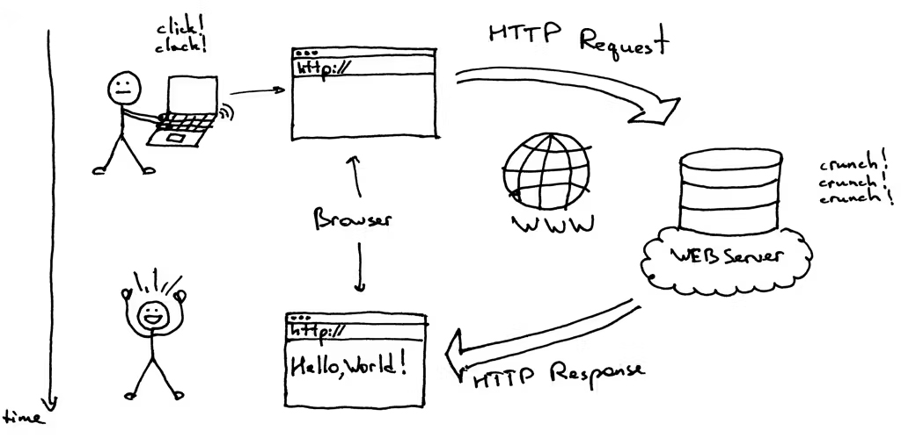
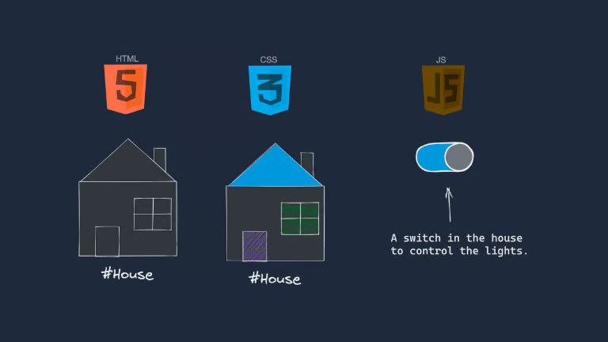
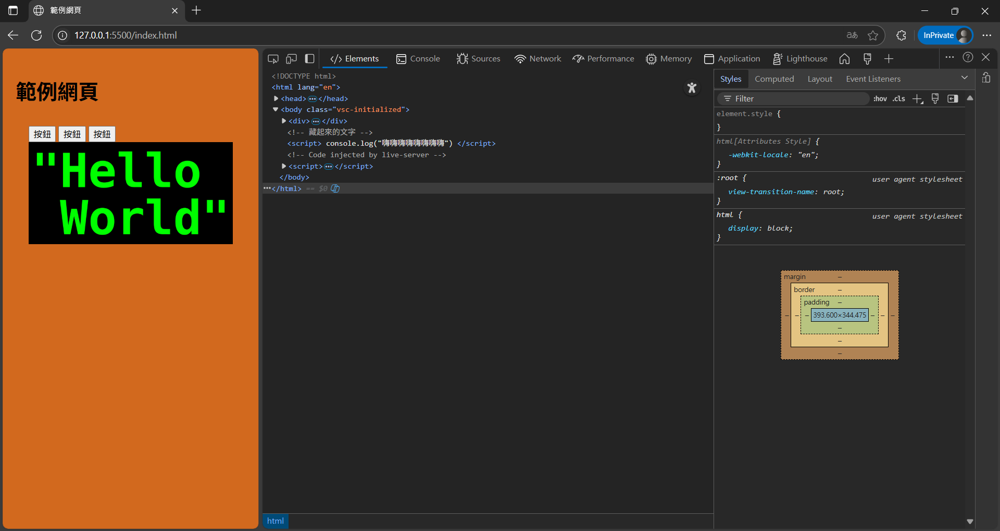
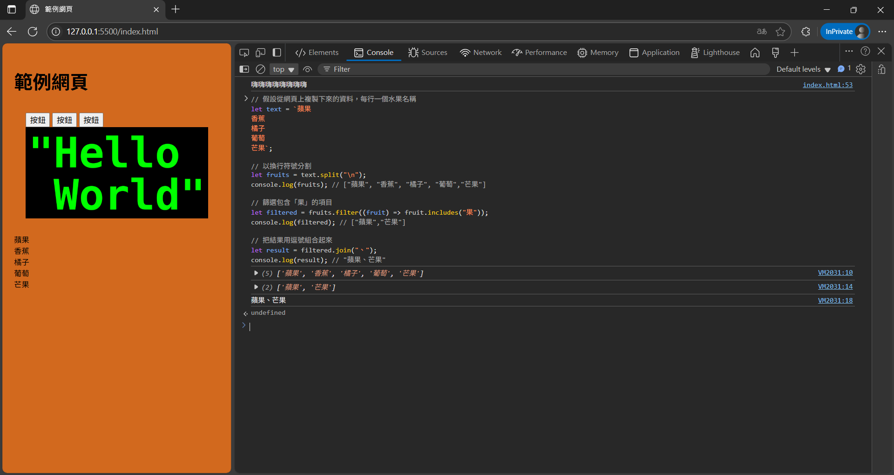
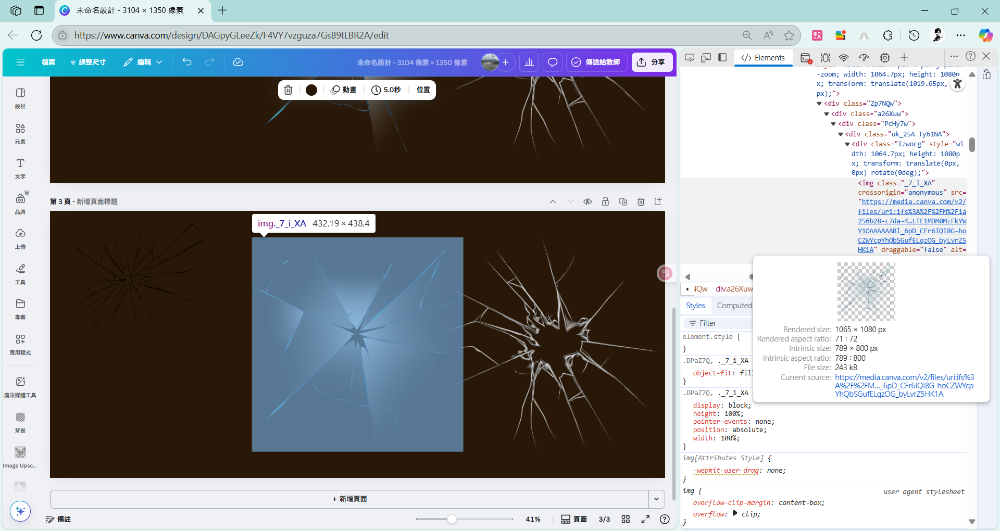
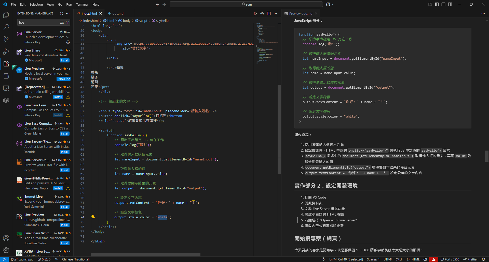
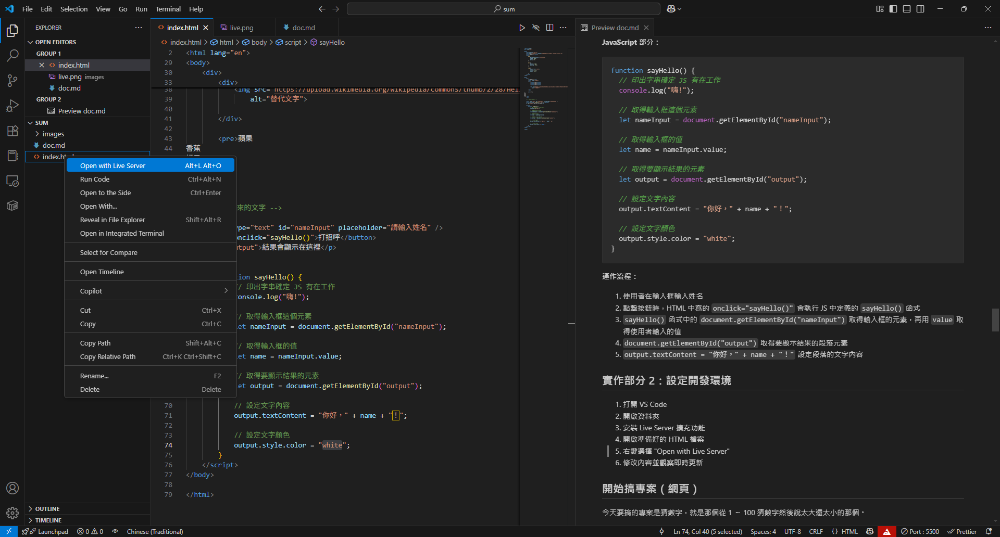
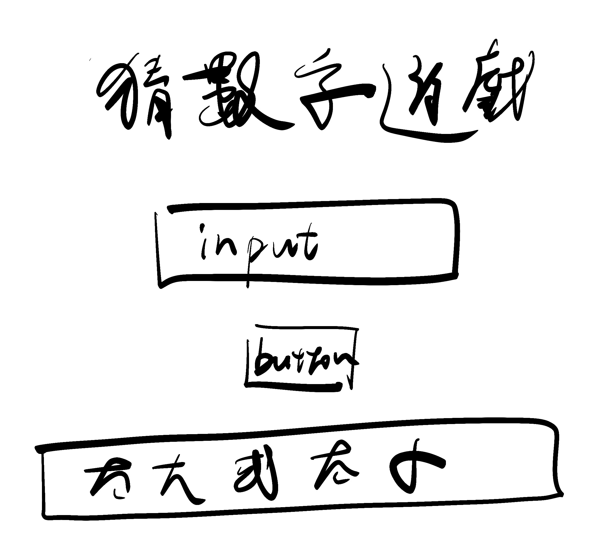

## 課程大綱

### 簡述

網頁是現在這個時代最廣泛使用的傳遞訊息媒介，尤其是在大量資訊公告以及使用者互動這方面有著不可取代的地位。本課程會藉由使用瀏覽器自帶的分析工具，說明網頁的組成架構以及製作方法。最後則透過專案製作的方式，一步一步的帶著學員製作出自己的網頁。

### 第一段（35）

先講一下網頁的超基礎知識（瀏覽器、搜尋引擎、伺服器之類的）(10)

先教網頁組成 HTML、CSS、JS(只教他們的用處）（10）

做一個範例網頁直接讓他們開 F12 ，先介紹 F12 的佈局和設定（10）

休息（5）

### 第二段（40）

教檢查、改字和圖片下載功能
\<h1>、\<p>、\<input>、\<button>、\<div>講這幾個就好
講標籤的結構和屬性（20）

講 CSS id class 的概念（10）

休息（10)
會出簡單的 web ctf （就 F12 翻東西而已)給不想休息的玩

### 第三段（50）

去 console 講 JS 基礎語法(講好用的工具和改字）（如果 C++ 先教就可以講快一點，如果沒有那要來刪東西了）（20m）
重點講 innerHTML 和 document.getElementById() 就好
反正就是寫猜數字遊戲會用到的就是了

稍微講一下專案規劃（10）

實際開檔案做網頁（螢幕分享）（寫好 HTML 結構 裝 live server（10）
目標做 todoist （如果他們太爛就做猜數字遊戲，好吧八成會改成這個）

[claude 弄的，我大概看過應該不會到太難](https://claude.ai/public/artifacts/2489f60c-dd52-4b22-9396-62abd4086c6e)

休息 （10）

### 第四段（40）

繼續實作網頁（40m）

### 實作

猜數字遊戲
F12 會有很多實作

### 成發可以做的事

自己想辦法

# 講義

> [!Note] 圖片之後補上

## 網頁概述

### 你是怎麼看到網頁的

網頁的運作涉及三個主要角色：

- **伺服器** (Server)
- **瀏覽器** (Browser)
- **搜尋引擎** (Search Engine)

使用者會打開搜尋引擎，透過**關鍵字**去尋找自己需要的網站，搜尋引擎就像**字典**一樣幫使用者找到對應的關鍵字對應的**網站網址**。

當你知道了**網站的網址**，就可以透過瀏覽器去向這個網址代表的伺服器去要資料，伺服器會返回網頁的**內容**，這個內容通常是 HTML 的格式，瀏覽器將這些 HTML 的資料轉變成使用者一般見到的**網頁**。


<< 瀏覽器和伺服器通訊示意圖

> [!note] 瀏覽器和搜尋引擎的差別
>
> **瀏覽器**
>
> > 像是 Chrome / Edge / Safari 他們的功能是把人類較難閱讀的 HTML 渲染成容易看懂的網頁
>
> **搜尋引擎**
>
> > 像是 Google / Bing 它的功能是讓使用者透過關鍵字找到網站的網址

### 網頁由什麼組成的

前面說了網頁是由 HTML 格式的資料做成的，但其實一個網頁通常也包含以下幾個重要的檔案類型：

- **HTML**（HyperText Markup Language，超文本標記語言）決定出現在網頁上的元素（例如圖片／按鈕／輸入框）
- **CSS**（Cascading Style Sheets，層疊樣式表）決定網頁上的元件的樣式及佈局（例如圖片的大小／按鈕的顏色／輸入框的位置）
- **JavaScript (JS)** 決定網頁上的元件與使用者的互動（例如點擊圖片後跳出詳細訊息／點擊按鈕後提交資料／在輸入框輸入文字後顯示搜尋結果）

這三個檔案類型在網頁一開始出現的時候就有了很重要的地位所以被稱為**網頁三兄弟**。


<< 網頁三兄弟示意圖

> [!note] HTML 不是程式語言
>
> **HTML** 是標記語言（Markup Language），不是程式語言
>
> > 標記語言是用來描述文件結構和內容的語言，不能執行邏輯運算 程式語言可以執行邏輯判斷、迴圈、函式等運算
>
> **JavaScript** 才是程式語言
>
> > 可以執行邏輯判斷、處理資料、響應使用者操作等

## F12 開發者工具

F12 是一個用來檢查網頁的工具，是每一個網頁設計師必備的技能。


<< F12 工具的外觀

### 外觀概述

- **設定頁面**：可以修改語言、禁用一些功能或開啟實驗性功能等等
- **元素面板 Elements**：可以看到當前網頁的 HTML 結構、CSS 樣式等等並能修改
- **控制面板 Console**：網頁中 JavaScript 輸出的訊息，可以用來執行 JavaScript 命令
- **來源面板 Sources**：在開發的時候可以看到原始碼還可以打斷點，用於調試程式碼
- **網路面板 Network**：檢測目前網頁的網路流量或禁用特定流量，可以看到詳細這些流量的內容像是要求的圖片或是請求 API 的方法等等
- **性能面板 Performance**：紀錄網頁生命週期中發生的事件，用來調整網頁的性能
- **內存面板 Memory**：用於檢測當前內存的使用狀態
- **應用面板 Application**：檢測載入資源，像是 Local Storage、cookies 等等
- **燈塔 Lighthouse**：用來進行 SEO 分析和網站品質檢測，蠻好用的

### Elements 元素面板

操作步驟：

1. 點左上角的選取按鈕（箭頭圖示）
2. 點擊網頁上的元素，會自動定位到那個元素的標籤位置
3. 可以查看標籤內容
4. 雙擊標籤屬性可以編輯（例如 id 或 class 等等）

> [!note] 好用場景
>
> 1. 有些圖片被鎖住右鍵，可以直接找到那個元素之後看他的 src 下載圖片
> 2. 有些 input 的 max 值被鎖住，可以修改他
> 3. 可以修改成績系統的顯示文字拿來騙人（但後臺其實不會變，該被當掉還是會被當掉）

### Elements->Style 樣式面板

1. 透過上面的方法找到想看的元素之後，下方（或右方）會跳出樣式面板
2. 每個樣式上面都會寫出 CSS 選擇器的來源
3. 下方會顯示具體的樣式
4. 滑鼠移動到左邊會顯示勾選框，可以暫時禁用那個樣式
5. 雙擊可以修改那個樣式


<< 使用檢查工具檢查畫面中按鈕的 HTML 和 CSS

### Console 控制台

1. 切換到 Console 面板可以在這裡執行 JavaScript 命令
2. 上方可以篩選想看到的資訊等級（像是只看到錯誤訊息）
3. 可以直接在這裡測試 JavaScript 程式碼(像是做簡單的文字處理)

#### Console 控制台的文字處理功能(補充)

在看網站找資料的時候，可以直接複製一段文字到 Console 面板進行處理：

```javascript
// 假設從網頁上複製下來的資料，每行一個水果名稱
let text = `蘋果
香蕉
橘子
葡萄
芒果`;

// 以換行符號分割
let fruits = text.split("\n");
console.log(fruits); // ["蘋果", "香蕉", "橘子", "葡萄","芒果"]

// 篩選包含「果」的項目
let filtered = fruits.filter((fruit) => fruit.includes("果"));
console.log(filtered); // ["蘋果","芒果"]

// 把結果用逗號組合起來
let result = filtered.join("、");
console.log(result); // "蘋果、芒果"
```

> [!Note]
> 聽起來超麻煩但用熟了再找資料的時候蠻方便的，很多時候只用開 F12 在控制台就可以一次處理完需要的資料?


<< 在 F12 中處理文字

### Network 網路面板(補充)

顯示網頁載入時的所有網路請求，包括：

- 圖片、CSS、JavaScript 檔案的載入
- API 請求和回應
- 載入時間和檔案大小
- 請求的詳細資訊

### Application 應用面板(補充)

可以檢視和管理：

- Local Storage 和 Session Storage
- Cookies
- Service Workers
- 快取資料

## 練習 1：F12 的使用

- 打開某個有顯示成績的網站，嘗試透過 F12 修改顯示的成績
- 打開 Canva，嘗試透過 F12 下載素材
- 打開 [QR 碼產生器：免費、彩色、加 LOGO](https://qr.ioi.tw/zh/)，嘗試下載超大張的 QR code
- 打開做好的特殊網頁，嘗試透過 F12 找到隱藏的東西
- 在隨便一個控制台輸入 `alert("彈出訊息");` 看看會發生啥事


<< 偷 Canva 上的素材 僅作教學使用

> [!note] 以下講述 HTML、CSS、JS 的概念，最下方有附上常見的語法提供參考

## HTML

HTML 是網頁的骨架，負責決定網頁上會看到的東西，就像是是裝潢的時候決定在房間裡擺一盞燈、一個電視或一道牆之類的。

### HTML 結構

每個網頁都必須遵守的部分，包含 html、head、title、body 等等
基本的 HTML 文件結構：

```HTML
<!DOCTYPE html>
<html>
<head>
    <meta charset="UTF-8"> <!-- 設定網頁的編碼為 UTF-8，支援中文 -->
    <title>網頁標題</title>

	<!-- CSS 寫在下面這裡 -->
    <style>
    </style>
</head>
<body>
    <h1>主標題</h1> <!-- 標題 -->
    <p>段落文字</p> <!-- 文字段落 -->

	<!-- JavaScript 寫在下面這裡 -->
    <script>
    </script>
</body>
</html>

```

<< 一份超基礎的 HTML 架構

### HTML 標籤

也就是讓使用者看到的元素
常見的 HTML 標籤：

- `<h1>` 到 `<h6>`：標題標籤
- `<p>`：段落
- ``：圖片
- `<button>`：按鈕
- `<input>`：輸入框
- `<div>`：區塊容器

**每個標籤的組成：**

1. **開始標籤**：`<標籤名稱>`
2. **屬性**：`key="value"` 格式，可以有多個屬性
3. **內容**：標籤包含的文字或其他標籤
4. **結束標籤**：`</標籤名稱>`

```html
<開始標籤 屬性="值" 屬性="值">內容</結束標籤>
```

**Button 標籤範例：**

```html
<button id="id001" onclick="myFunction()">點我！</button>
```

標籤架構分解：

- **開始標籤**：`<button ... >`
- **屬性名稱 1** : `id`
- **屬性值 1** : `id001`
- **屬性名稱 2**：`onclick`
- **屬性值 2**：`"myFunction()"`
- **內容**：`點我！`
- **結束標籤**：`</button>`

> [!note] HTML 標籤的屬性
> 不同標籤會有他們自己獨有的屬性，像是 `<input>` 標籤就有自己的一個獨特屬性叫做 `type`，如果在 HTML 中寫 `<input type='number'>` 使用者就只能輸入數字，不過在 `<button>` 標籤中這個屬性就沒有用。
> 可以直接上網搜尋 `mdn input tag` 或 `mdn xxx tag` 去找不同 tag 的用法

## CSS

HTML 是骨架，CSS (Cascading Style Sheets) 是網頁的外觀、妝容。它負責所有跟「好不好看」有關的事。就像是裝修時要決定牆壁顏色，光線明暗之類的東東。

### CSS 基礎語法

CSS 的語法非常直觀：
`選擇器 { 屬性: 值; }`

- **選擇器 (Selector)**：你要對「誰」做這件事？（例如：所有的 `<p>` 標籤）（常見的選擇器還有 id 和 class 請見下方）
- **屬性 (Property)**：你要改變它的什麼？（例如：文字顏色 `color`）
- **值 (Value)**：你要把它改成怎樣？（例如：紅色 `red`）

```css
/* 這段 CSS 會讓所有 <p> 標籤的文字都變成紅色 */
p {
  color: red;
}
```

在 HTML 中，通常把 CSS 寫在 `<head>` 裡面的 `<style>` 標籤中（請見下方 HTML 架構）。

### Class 和 Id

**Class** 和 **Id** 都是 HTML 標籤的屬性之一，也是最常拿來做 CSS 選擇器的屬性：

- **Id**：通常一個元素只會有一個唯一的 id，通常用來標註特定元素，方便程式取得那個標籤的相關資料，例如使用者在特定輸入框輸入的值。id 就像你的學號一樣一人一個。
- **Class**：一個元素可能會有很多個 class，一個 class 也可以對應到很多個元素，通常拿來讓 CSS 針對不同的元素做出不同的樣式。例如給不同標籤加上 `red` 這個 class，這樣就可以透過 CSS 讓他們變成紅色。class 就像班級或年級一樣，很多人同一個。

```html
<!DOCTYPE html>
<html>
  <head>
    <meta charset="UTF-8" />
    <title>網頁標題</title>

    <style>
      /* 選取 id 為 header 的元素 */
      #header {
        color: blue; /* 藍色文字 */
      }

      /* 選取 class 為 red 的所有元素 */
      .red {
        background-color: red; /* 黃色背景 */
      }
    </style>
  </head>
  <body>
    <div id="header" class="red bold">標題</div>
    <p class="red">紅色段落</p>
  </body>
</html>
```

<< 透過 id 和 class 作為選擇器修改頁面中元素的顏色

> [!Note]
> 在標籤中用 `id="id"` 或 `class="class"` 來定義
> 在 css 中用 `#id` 或 `.class` 來選取

> [!note] 用 p 標籤然後用 css 把字體調大當標題不就好了為啥要用 H1 標籤？
> 有些時候 css 不一定會被渲染，像是一個機器人自動抓取網頁的內容，他會去抓取 h1 標籤，而不是抓取所有 p 標籤然後篩選他的文字大小
> 另個例子是有些視障會依賴語音導覽系統去閱讀網站，這樣的朗讀系統也是要依照 h1 標籤來知道這個內容是標題，而不是看 css
> 除了 h1 這個例子外還有很多相關的東東，可以去搜尋 `html 語意化標籤`

## JavaScript

### JavaScript 基礎語法

JS 的語法跟 C++ 很像，下面是一些對照（大家應該還記得 c++ 怎麼寫吧）

| 語法功能 | JavaScript                             | C++                                       |
| -------- | -------------------------------------- | ----------------------------------------- |
| 變數宣告 | `let x = 10;` 或 `const x = 10;`       | `int x = 10;`                             |
| 函式定義 | `function add(a, b) { return a + b; }` | `int add(int a, int b) { return a + b; }` |
| 印出     | `console.log("Hello");`                | `cout << "Hello";`                        |
| 字串串接 | `"Hello " + name`                      | `"Hello " + name` _(使用 `std::string`)_  |
| 判斷式   | `if (x > 0) { ... } else { ... }`      | `if (x > 0) { ... } else { ... }`         |
| 迴圈     | `for (let i = 0; i < 5; i++) { ... }`  | `for (int i = 0; i < 5; i++) { ... }`     |
| 陣列     | `let arr = [1, 2, 3];`                 | `int arr[] = {1, 2, 3};`                  |

<< JS 和 C++ 語法對照

> [!Note] JavaScript 與 C++ 差異
>
> - **變數不需宣告型別**：JS 使用 `let` / `const` 宣告變數，不需指定型別。
> - **函示不需宣告返回值型別**：JS 使用 `function` 宣告函示，不需指定返回值的型別。
> - **陣列與物件皆為內建型別**：JS 中陣列、物件皆可直接操作，且可混合型別，像是可以在一個陣列中放數字又放字串。
> - **不用考慮讀陣列會不會超過長度**：JS 中開一個陣列 a 放 5 個東西，我讀取 a[100] 他也不會報錯只會反回 `undefined`
> - **執行環境不同**：JS 通常在瀏覽器（或 Node.js）執行，與 HTML/CSS 綁定性高。
> - JavaScript 還不強制要每一行打一個 `;`

除了跟 C++ 長的很像的基礎語法外 JavaScript 是讓網頁具有互動性的程式語言，所以有許多專門拿來操作 HTML 元素的方法。下面這部分只會講最後實作的時候會用到的方法：

### 重要的 JavaScript 方法：

1. **console.log("某些文字")**：在控制台輸出資訊方便 deBug
2. **document.getElementById( 元素 id )**：透過 id 取得要操作的元素，通常會把它存在一個變數裡面
3. **onclick="自訂函數"**：點擊事件的屬性（其實這算 HTML 的內容）
4. **某某元素.textContent**：取得或修改元素的文字內容（若是要修文字內容，寫`改某某元素.textContent = "要修改成的文字"` 就可以修改了）
5. **某某元素.value**：取得或修改輸入框的值（修改方式同上）
6. **某某元素.style.屬性名稱 = "屬性值"**：設定元素的樣式

#### 範例：

**HTML 部分：**

```html
<input type="text" id="nameInput" placeholder="請輸入姓名" />
<button onclick="sayHello()">打招呼</button>
<p id="output">結果會顯示在這裡</p>
```

**JavaScript 部分：**

```javascript
function sayHello() {
  // 印出字串確定 JS 有在工作
  console.log("嗨!");

  // 取得輸入框這個元素
  let nameInput = document.getElementById("nameInput");

  // 取得輸入框的值
  let name = nameInput.value;

  // 取得要顯示結果的元素
  let output = document.getElementById("output");

  // 設定文字內容
  output.textContent = "你好，" + name + "！";

  // 設定文字顏色
  output.style.color = "white";
}
```

**運作流程：**

1. 使用者在輸入框輸入姓名
2. 點擊按鈕時，HTML 中寫的 `onclick="sayHello()"` 會執行 JS 中定義的 `sayHello()` 函式
3. `sayHello()` 函式中的 `document.getElementById("nameInput")` 取得輸入框的元素，再用 `value` 取得使用者輸入的值
4. `document.getElementById("output")` 取得要顯示結果的段落元素
5. `output.textContent = "你好，" + name + "！"` 設定段落的文字內容

## 實作部分 2：設定開發環境

1. 打開 VS Code
2. 開啟資料夾
3. 安裝 Live Server 擴充功能
4. 開啟準備好的 HTML 檔案
5. 右鍵選擇 "Open with Live Server"
6. 修改內容並觀察即時更新


<< 安裝 Live Server 擴充功能


<< Open with Live Server

## 開始搞專案（網頁）

今天要搞的專案是猜數字，就是那個從 1 ～ 100 猜數字然後說太大還太小的那個。

### 定目標 (MVP 方法)

最小可行產品（Minimum Viable Product）！不然很容易專案爛尾

1. **找一個主要的目標** → 要能夠輸入數字然後返回太大還太小
2. **找一些附帶目標** → 猜對的時候要有特別的效果、統計猜的數字和時間
3. **找一些可有可無的目標** → 很帥的動畫效果、最佳成績系統
4. 先預估一下每一個目標完成需要的時間，一步一步實現，不要先做可有可無的東西，也不要在開發過程中隨便增加目標，不然真的很容易做不完
5. 雖然說要先實現主要目標，但在開發的時候要練習考慮整個系統的架構，讓未來的其他目標的實現可以輕鬆一點（但猜數字其實沒什麼好架構可言啦）

### 做 UI 設計

有很多方法可以做 UI 設計：

- **手繪**：用紙筆畫出介面草圖
- **Canva**：使用線上設計工具
- **Figma**：專業的 UI/UX 設計工具
  主要就是畫出每個元件在畫面上的位置、顏色等等。也可以透過簡單的文字敘述或箭頭說明操作邏輯。


<< 隨便畫的 UI 設計

### 寫程式（html 部分）

1. **用 HTML 和簡單的 CSS** 把 UI 設計稿中的元素放上去
2. css 此時只需要注意元素的相對位置，不要管顏色之類的東西

### 寫程式（JS 部分）

1. 用前面提到的方法添加按鈕點擊的事件
2. 讀取輸入的值
3. 顯示結果

### 寫程式（CSS 部分）

1. 修改每個元素的**顏色**、**間距**等等

## 實作部分 3 做出那個猜數字網頁！！

### 範例

```html
<!DOCTYPE html>
<html>
  <head>
    <title>猜數字遊戲</title>
    <style>
      body {
        font-family: Arial, sans-serif;
        text-align: center;
      }
      .game-container {
        margin: 50px auto;
        max-width: 400px;
      }
      input {
        padding: 10px;
        font-size: 16px;
        width: 100%;
      }
      button {
        margin-top: 20px;
        padding: 10px 20px;
        font-size: 16px;
      }
      .result {
        margin: 20px 0;
        font-size: 18px;
      }
    </style>
  </head>
  <body>
    <div class="game-container">
      <h1>猜數字遊戲</h1>
      <p>我想了一個 1 到 100 之間的數字，快猜！</p>
      <input
        type="number"
        id="guessInput"
        min="1"
        max="100"
        placeholder="輸入你的猜測"
      />
      <button onclick="checkGuess()">猜！</button>
      <div id="result" class="result"></div>
    </div>

    <script>
      let secretNumber = Math.floor(Math.random() * 100) + 1;

      function checkGuess() {
        let input = document.getElementById("guessInput").value;
        let guess = parseInt(input);
        let result = document.getElementById("result");

        if (guess === secretNumber) {
          result.textContent = `恭喜！你猜對了！答案是 ${secretNumber}`;
          result.style.color = "green";
        } else if (guess < secretNumber) {
          result.textContent = "太小了！再試試看";
          result.style.color = "blue";
        } else {
          result.textContent = "太大了！再試試看";
          result.style.color = "red";
        }

        document.getElementById("guessInput").value = "";
      }
    </script>
  </body>
</html>
```

線上範例 [https://jx06t.github.io/sum/demo.html](https://jx06t.github.io/sum/demo.html)

### 專案擴展想法

完成基本功能後，可以考慮添加：

- 重新開始遊戲的按鈕
- 遊戲時間計時
- 最佳成績記錄
- 不同難度等級
- 更炫的視覺效果和動畫

# 附錄：HTML 標籤與 CSS 用法整理

## HTML 常見標籤與用法

### `<h1>` \~ `<h6>`：標題標籤

- 用途：定義標題，`h1` 表示最重要的標題，`h6` 為最小
- 範例：

```html
<h1>這是主標題</h1>

<h2>這是次標題</h2>
```

### `<p>`：段落文字

- 用途：定義一段文字段落
- 範例：

```html
<p>這是一段文字內容</p>
```

### ``：圖片

- 常用屬性：
- `src`：圖片路徑（必填
- `alt`：圖片無法顯示的替代文字（建議填）
- `width` / `height`：圖片寬高（可選）
- 範例：

```html

```

### `<a>`：超連結

- 常用屬性：
- `href`：連結的網址
- `target="_blank"`：在新分頁打開
- 範例：

```html
<a href="https://example.com" target="_blank">前往網站</a>
```

### `<button>`：按鈕

- 常用屬性：
- `onclick="函式()"`：點擊時執行 JS 函式
- `type`：按鈕型態（`button` / `submit` / `reset`）
- 範例：

```html
<button type="button" onclick="sayHello()">點我</button>
```

### `<input>`：輸入欄位

- 常用屬性：
- `type`：輸入欄位型態（`text`, `number`, `password`, `checkbox`, `radio` 等）
- `placeholder`：提示文字
- `value`：預設值
- `id` / `name`：辨識欄位用
- `min` / `max`：數值輸入範圍限制
- 範例：

```html
<input type="text" placeholder="請輸入名字" />
<input type="number" min="1" max="100" />
```

### `<div>`：容器區塊

- 用途：用來包裝一組元素，常用於排版或分區
- 常用屬性：`id`, `class`
- 範例：

```html
<div class="section">
  <p>段落在這裡</p>
</div>
```

---

### `<span>`：行內容器

- 用途：與 `<div>` 類似，但是「行內元素」，適合包文字用樣式
- 範例：

```html
<p>這是 <span class="highlight">重點</span> 文字。</p>
```

### `<ul>` / `<ol>` / `<li>`：清單

- `<ul>`：無序清單（圓點）
- `<ol>`：有序清單（數字）
- `<li>`：清單項目
- 範例：

```html
<ul>
  <li>蘋果</li>
  <li>香蕉</li>
</ul>
<ol>
  <li>第一步</li>
  <li>第二步</li>
</ol>
```

### `<br>`：換行

- 用途：強制換行（無結束標籤）
- 範例：

```html
這是第一行<br />這是第二行
```

### `<hr>`：水平線

- 用途：插入一條分隔線（無結束標籤）
- 範例：

```html
<p>段落一</p>
<hr />
<p>段落二</p>
```

### `<script>`：嵌入 JavaScript

- 可寫在 `<head>` 或 `<body>` 中
- 範例：

```html
<script>
  alert("Hello");
</script>
<script src="main.js"></script>
```

### `<style>`：內部 CSS 樣式

- 放在 `<head>` 裡面撰寫 CSS
- 範例：

```html
<style>
  body {
    background-color: lightblue;
  }
</style>
```

## CSS 常見用法與語法說明

### 基本語法結構

```css
選擇器 {
  屬性名稱: 值;
}
```

### 文字相關屬性

```css
color: red; /* 文字顏色 */

font-size: 16px; /* 字體大小 */

font-weight: bold; /* 文字粗體 */

text-align: center; /* 置中對齊 */

text-decoration: underline; /* 底線/刪除線 */
```

### 背景與邊框

```css
background-color: yellow; /* 背景顏色 */

border: 1px solid black; /* 黑色實線邊框 */

border-radius: 8px; /* 圓角邊框 */

box-shadow: 2px 2px 5px gray; /* 陰影 */
```

### 排版與間距

```css
width: 300px; /* 寬度 */

height: 150px; /* 高度 */

margin: 20px; /* 外距 */

padding: 10px; /* 內距 */

display: block; /* 區塊顯示 */

margin: 50px auto; /*將元素水平置中*/
```
